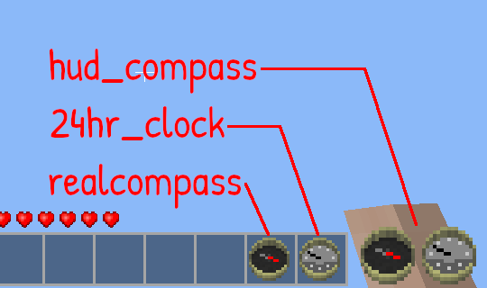

24hr Clock [24hr_clock]
=======================

A 24hr clock with one hand.

David_G (kestral246@gmail.com)

**New:** I have updated this mod to work with the craftguide mod. *(Thanks to feedback from FreeGamers.)*



Shown are all my compass and clock mods.

*Based on my hud_compass mod, which provides both a compass and a 24hr clock that can be optionally enabled and placed in any of the four corners of the player's screen.*

Crafting guide
--------------

```
              , tin_ingot   ,
  copper_ingot, glass       , copper_ingot
              , copper_ingot,
```


License
-------
- **new textures:** derived from ccompass, textures CC BY-SA by tacotexmex (changes by kestral246 also CC BY-SA)
- **code:**  My changes to original code are CC0-1.0
- **original compassgps license:** Original code by Echo, PilzAdam, and TeTpaAka is WTFPL. Kilarin (Donald Hines) changes are CC0 (No rights reserved)

