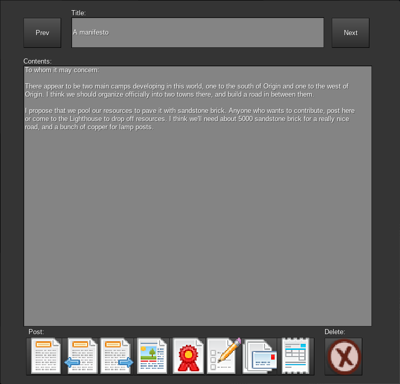

## Bulletin boards

This mod adds global bulletin boards to Minetest. These are boards where players can post short notes for other players to see, at a nominal cost.

|  |  |

Each board can hold up to 56 bulletins (in an 8 by 7 grid), with each bulletin having a title and an icon that can be set by the player posting it. Once the bulletin board nears capacity, older bulletins will start being culled from the board to make room for new bulletins. They will be culled by preference starting with the bulletins belonging to the players who have the most bulletins currently posted, followed by the oldest bulletin belonging to those players.

So for example, if Alice has 1 bulletin on the board, Bob has 2 bulletins on the board, and Collin has 2 bulletins on the board, then when it comes time to cull a bulletin the oldest one belonging to either Bob or Collin will be culled. If that happens to be Bob's, then next time it's time to cull Alice will have 1, Bob will have 1, and Collin will have 2, so the oldest of Collin's bulletins will be culled. This ordering is done to try to balance things out fairly - players that hog the board with multiple bulletins will have their bulletins culled more often, but everyone's single most recent bulletin will stick around as long as possible.

Bulletin boards can have a cost associated with posting. If the player has the cost (an item stack) in their inventory, they can post and the cost will be automatically deducted.

Boards are "global", in the sense that all instances of a given type of board will have the same content regardless of where they are in the world. This can make them useful as a means of communication over distance as well as time, serving as a sort of public post office.