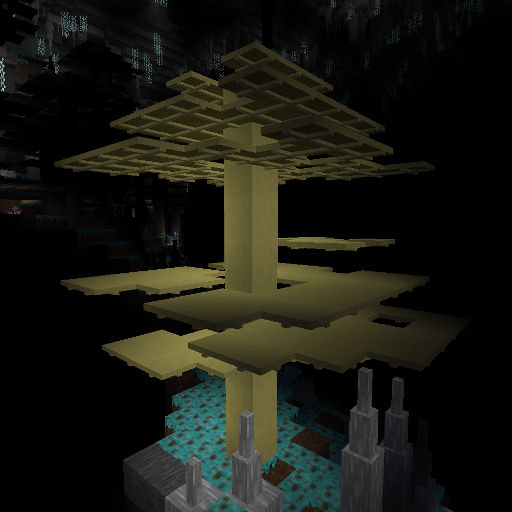
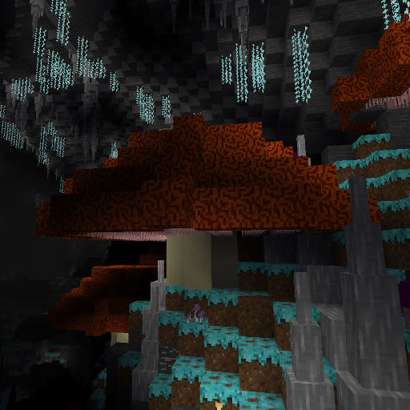
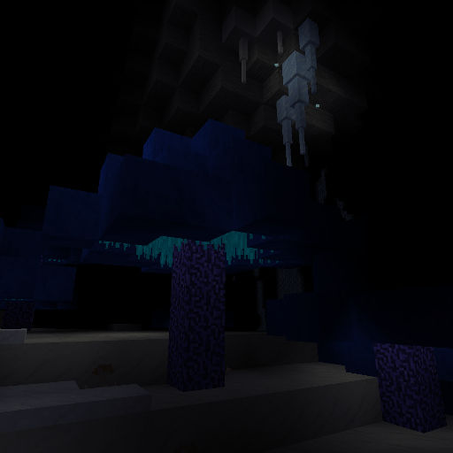
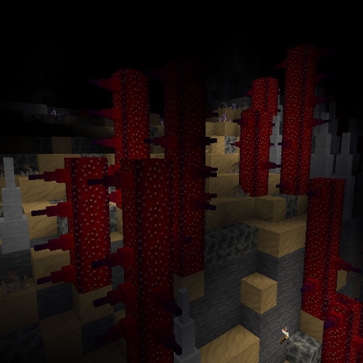
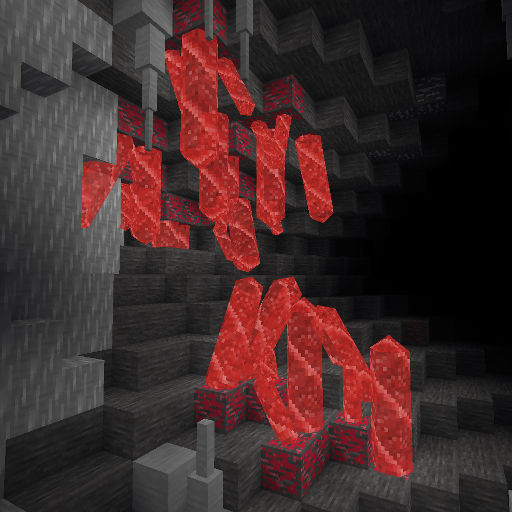
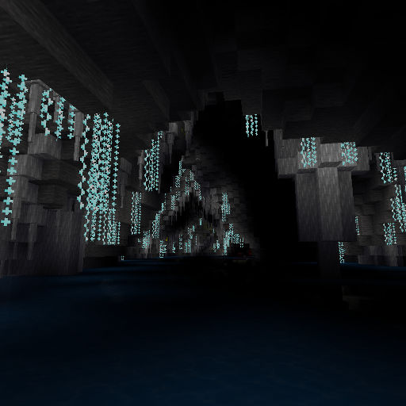
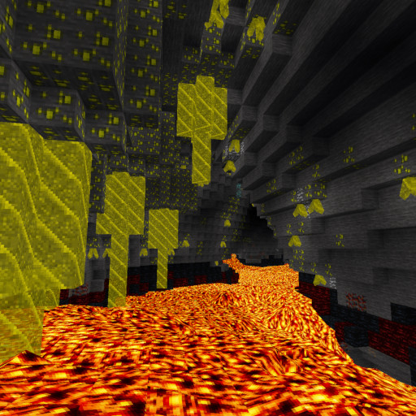

The following is a comprehensive description of the various cavern layers, plants, trees, minerals, and other such novelties in the DF Caverns mod. Players may wish to avoid reading it so as to not be spoiled on some of the things they may discover in the deep places of the world.

# Common features found on many layers

## Speleothems

There are three main varieties of [speleothem](https://en.wikipedia.org/wiki/Speleothem) that can be found in caves ranging from the surface sea level down to the Sunless Sea; stalactites, stalagmites, and large flowstone formations. Stalactites and stalagmites are small single-node-thick structures that form tapered spikes and flowstone is composed of conventional cubical blocks. All are composed of minerals deposited by flowing water. They come in "wet" and "dry" forms whose only difference is visual; wet flowstone is found in damp places where water still flows over its surface and dry flowstone is "dead." Stalactites and stalagmites mirror each other on the floor and ceiling of caves; stalagmites form from drops that fall off the tip of stalactites. When floor and ceiling are close enough together the two can eventually grow to meet, forming a column.

Inside the large caverns gigantic versions of stalactites and stalagmites can be found, producing columns that can be tens of meters in diameter.

## Cave moss

Cave moss is technically a form of mold, but fortunately a relatively benign one given its ubiquity. Its fibers form a tough but springy mat over the surface of any organic-rich soil that accumulates deep underground. It is essentially the "grass" of the deeps. Cave moss is faintly bioluminescent and so is useful for visually defining the floor spaces of giant caverns that would otherwise be a yawning pit of blackness.

Underground farming can be done directly on cave moss, but it is best if the soil is tilled with a hoe. Cave moss will slowly spread to adjacent bare soil nodes, but if it's exposed to bright light for a period of time it will die back and leave bare soil again.

## Floor fungus

Floor fungus produces a thin, slick film that spreads through the cracks of broken rock. Its ability to subsist on the tiniest traces of nutrients means it's found in relatively harsh underground environments. Floor fungus has no known uses. It can penetrate deeply into cobblestone constructions if an infestation gets hold, but it is difficult to transport and is inhibited by light so it hasn't spread beyond the deep caverns.

Underground farming can be done on floor-fungus-infested cobble, but growth is very slow. Floor fungus doesn't bioluminesce so caverns with floor fungus tend to be much darker and harder to navigate than cave moss areas.

## Glow worms

Glistening strings of silk hang from the ceilings of some of the larger and moister caverns, lit by the millions of tiny bioluminescent worms that spun them. Glow worms prey on the insects they lure and entangle with their faux starry sky - and sometimes the occasional bat or other larger flying beast.

Glow worms can be harvested and used as a source of light but they die when exposed to light significantly brighter than themselves or when immersed in water. A colony of glow worms hung in a hospitable environment will undergo a modest amount of growth, allowing it to be divided and propagated.

# Farmable organisms

## Plump helmet

A basic staple food of the underground realms, plump helmets are thick purplish mushrooms that grow well under almost any condition except direct exposure to light. Plump helmets can be picked and eaten unprepared, and propagate easily.

## Cave wheat

Cave wheat is literally a breed of grain-producing grass that somehow lost its ability to photosynthesize and adapted to a more fungal style of life. Like its surface cousin, cave wheat produces grain that can be ground into a form of flour. Cave wheat flour can be baked into a tough, durable form of bread, or combined with other ingredients.

## Sweet Pods

Sweet pods grow in rich soil, and once they reach maturity they draw that supply of nutrients up to concentrate it in their fruiting bodies. They turn bright red when ripe and can be processed in a variety of ways to extract the sugars they contain. When milled or dried in an oven, sweet pods produce a granular sugary substance. Crushing them in a bucket squeezes out a flavorful syrup.

## Pig tails

Pig tails are a fibrous fungal growth that's most notable for its twisting stalks. In a mature stand of pig tails the helical stalks intertwine into a dense mesh. Pig tail stalks can be processed to extract fibers useful as thread.

## Dimple cups

The distinctive midnight-blue caps of these mushrooms are inverted, exposing their gills to any breeze that might pass, and have dimpled edges that give them their name. Dimple cups can be dried, ground, and processed to extract a deep blue dye.

## Quarry bushes

A rare breed of fungus from deep underground that produces a bushy cluster of rumpled gray 'blades'. The biological function of these blades is not known, as quarry bushes reproduce via hard-shelled nodules that grow down at the blade's base. Quarry bush leaves and nodules (called 'rock nuts') can be harvested and are edible with processing. The dried blades of a quarry bush add a welcome zing to recipes containing otherwise-bland subterranean foodstuffs, but they're too spicy to be eaten on their own.

## Torchspines

Torchspines are strange organic formations that are alive only in a technical sense. They "feed" on volatile flammable vapors vented up through their structure, growing from combustion residue deposited at their tips. A torchspine alternates between active and quiescent phases and emits dim light when active. They can be harvested for torches, and their embers sprout into new torchspines when placed on flammable surfaces.

Physically, they resemble stalagmites. Unlike most underground growths they are unaffected by bright light.

# First cavern layer

By default, the first cavern layer can be found between -200 and -800 meters elevation. Biomes found on this level include Tower Cap, Fungiwood and "barren" caverns that lack significant organic growth. Some caverns have lakes of water filling their lower regions, others have little or no standing water.

## Tower Cap caverns

Tower Caps are enormous pale mushrooms with woody stems and caps. Aside from their sheer size there's not much unusual about them; they are useful as a substitute for surface wood and can be used for most wood-requiring crafting recipes. Plump helmets also grow here.

## Fungiwood caverns

Fungiwoods have thinner stalks that sprout numerous thin irregular "shelves" branching out along its height. The shelves are useless except as fuel, but the main stem of a fungiwood is another wood substitute.

Plump helmets and cave wheat grow here.

## Spindlestems

Spindlestem mushrooms are the weedy "saplings" of the upper fungal forests, too large to pick by hand but not exactly inspiring tree-like analogies. They are common, though, and not without their uses. Their long stems can serve as a wood substutitue in many crafts and their bioluminescent caps can produce a long-lived glowing extract that's useful as a source of light. They grow taller when crowded.

The bioluminescence of Spindlestems are actually a very interesting feature. Despite their apparent visual diversity, Spindlestems are a single species. They pick up their glow from symbiotic microorganisms that colonize their caps, and the specific breed of symbiote that thrives in any given Spindlestem depends on the minerals present in the nearby rocks. Iron results in a weak red-glowing cap, copper results in a green-tinted cap, and the combination of both can result in a brighter cyan glow. Brilliant yellow "Golden Spindlestems" have also been spotted.

For some reason, Spindlestems that grow in the presence of Tower Caps are never luminescent. Perhaps they're intimidated.

# Second cavern layer

By default, the second cavern layer can be found between -800 and -1400 meters elevation. Like the first layer, some caverns contain lakes filling their lower regions. The dry barren caverns at this level will have some occasional ruby crystal growths in them, but they will be detailed in an entry on the third cavern layer where they're much more common.

## Goblin Cap caverns

Goblin caps are the broader, squatter cousins of the Tower Cap fungus. Like Tower Caps they have no particular special properties, but their wood comes in two different colours - the reddish orange of their caps and the cream coloured stem wood. Plump helmets and Spindlestems grow here.

For some reason, Spindlestems that grow in the presence of Goblin Caps are always red.

## Spore Tree caverns

Spore trees are the smallest of the underground fungal "tree" types, with a simple stem supporting a sponge-like three-dimensional mesh of hyphae. The mesh can be easily climbed, so navigating a spore tree forest is quite easy, and when harvested can be crafted into ladders quite quickly and easily. Fruiting bodies are embedded in the mesh that produce a copious amount of spores that gently rain down around the spore tree's base.

Cave wheat and pig tails can be found growing here.

## Tunnel Tube caverns

Tunnel tubes are hollow, curved fungal growths that support a fruiting body at their tip. The trunk of a tunnel tube can be cut and processed to produce plywood-like material. The fruiting body accumulates high-energy compounds that, when ignited, produce a vigorous detonation - a unique adaptation for spreading tunnel tube spawn through the still cavern air. If the TNT mod is enabled tunnel tube fruiting bodies can be detonated like weak TNT blocks and can be harvested for gunpowder.

Sweet pods and cave wheat can be found growing in tunnel tube caverns.

## Cave pearls

At these depths you may find a distinctive and beautiful formation encrusting the ceilings and walls of smaller tunnels and warrens; "cave pearls." These nodules are actually calcified bacterial colonies that can only form where they're left undisturbed for the long periods needed for them to grow this large.

# Third cavern layer

The third cavern layer is where things start to get really exotic. Black Caps, Nethercaps, Bloodthorn and reddish glowing crystal formations are found here. Those caverns that are partly-flooded have unusual features thanks to the strange life sharing them. By default the third cavern layer runs from -1400 to -2000 meters.

## Black Cap caverns

Black Cap caverns are dark, sooty, carbon-rich places. The Black Caps themselves are fairly mundane as underground flora goes, giant black mushrooms whose tarry gills can be used to craft torches and whose wood burns as strongly as coal blocks.

Also found in Black Cap caverns are torchspines, stalagmite-like growths that sometimes burn volatile gasses at their tips and produce a dim, irregular light. When water lakes are found in Black Cap caverns the water has an oily sheen on the surface, collecting into thick black slicks that cling to the shores.

## Nethercap caverns

Nethercaps break the known laws of thermodynamics by somehow "feeding" directly on heat. As a result Nethercap caverns are frigid and icy, with icicles mixed with stalactites and giant columns of frozen water. Nethercap caverns have little other life in them as a result. They are lit by the blue glow of the Nethercap's gills, as well as by the mysterious "ice sprites" that hover and sparkle near the ceilings and by the streaks of hoar moss that grow on the surfaces of ice columns.

Any liquid water that touches Nethercap wood will freeze, even if the Nethercap has been harvested and crafted into other forms. Nethercap will not burn and indeed will snuff out fires and even solidify lava it touches. If a Nethercap cavern has a lake its surface will be covered in a solid sheet of ice.

Ice sprites, mysterious glowing insect-like creatures that appear to be made partly of crystalized water, flit and flicker under the icicles hanging from the ceilings of these caverns. Softly glowing hoar moss forms in sheets on columns of ice.

## Bloodthorn caverns

Bloodthorns are cactus-like in appearance and habitat, growing in dry sandy caverns, but they are far more agressive about seeking moisture than their surface kin. Bloodthorns have thick spines projecting randomly from their trunks that are coated in smaller barbs that greedily drain fluids from any creature that touches them. You can climb a bloodthorn quite easily, using its spines like rungs on a ladder, but it will hurt to do so. Bloodthorn caverns are dimly lit so take care not to blunder into the rows of bloodthorns that grow like living fences.

Lakes are never found in Bloodthorn caverns and the cracks in the rock that would normally seep moisture are choked with crystals of salt. Some of the salts seem to containe traces of Mese, giving them a faint unearthly glow.

Quarry bushes can be found here.

## Barren crystal caverns

On the third cavern layer the dry barren caverns will sprout clusters of enormous hexagonal red crystals from their floors and ceilings, providing light. These crystals have no particular use but are rare and beautiful to look at.

# Sunless Sea

The Sunless Sea is the final destination of all water that flows down through the cracks in the Earth. By default the caverns of the Sunless Sea begin at -2000 and go down to -2400 meters, with the lower sea level of the world being halfway between at -2200.

Compared to the previous layer the Sunless Sea is actually a much richer and more hospitable environment, and along the shores are found a variety of fungi from higher levels. One biome has a mixture of Tower Cap and Goblin Cap, and another biome mixes Spore Tree and Fungiwood. The smaller farmable plants and fungi from the various levels are also found here, with the exception of Torchspines. One unique fungus is found here; dimple cups grow among their larger Tower Cap and Goblin Cap cousins.

The distinguishing feature of the Sunless Sea is the vast expanse of water to be found here. The caverns themselves are broader in extent than those found higher up, heavily eroded by the steady flow of water, and a network of rivers spider-web the cracks between the larger caverns and allow for an intrepid sailor to travel great distances.

Below the surface of the water Snareweed can be found, a dangerous kelp-like growth that uses bioluminescence and reflective patches to lure cave fish close enough to snag with their barbs. Swimming through Snareweed is a painful experience. Deeper down are craggy towers of softly glowing Cave Coral.

This is the last stop for the living world, however. Caverns continue to stretch below but nothing grows down there.

# Lakes of Oil

Venturing below the Sunless Sea will require either a great deal of digging through solid rock or a lengthy SCUBA swim through flooded tunnels. Getting past the water doesn't guarantee that you'll be able to breathe, however.

Eventually, at around -2600 meters elevation, an explorer may encounter lakes of oil in lenticular caverns. Falling into a lake of oil is an unpleasant experience - one is completely blind when below the surface - but that's not the real danger. The atmosphere above the oil is filled with unbreathable gasses that are explosive when mixed with air and an ignition source (such as a carelessly placed torch). Even in the tunnels above the oil there are occasional gas seeps venting this gas from cracks and seams of coal. This gas is heavier than air and will pool in depressions, and of course it cannot be swum through so take care not to jump down into a place you can't easily climb back out of.

A few mysterious blue flames may occasionally be found flickering on the edges of oil lakes, burning without oxygen and seeming to maintain their size as they drift about through the unbreathable atmosphere. These "gas wisps" may be a strange form of plasmoidal life but they are easily snuffed and so little is known about them.

Buckets of oil serve as an excellent fuel source, powering a furnace as well as a block of coal.

# Magma Sea

Below the lakes of oil, around -2800 meters elevation, is the Magma Sea. A dense network of cracks filled with liquid rock, the only way through is by digging a passage of your own through whatever remains solid.

The Magma Sea is not without its treasures, however. In the most infernal regions the heat and strange vapors have resulted in the formation of Mese crystals of unparalleled purity on the ceilings hanging over the lava. These regions are rare but if you're in need of Mese then you can strike a mother lode down here.

# Underworld

The foundations of the world lie at -3100 meters, under a default configuration. The diggable rock of the world ends at a rippling layer of invulnerable Slade, a material of unparalleled density. There is a cavern layer at the seam between rock and Slade, however, as if the earth itself was reluctant to touch the strange matter below. The crevices of the ceiling have strange glowing rocks in them, producing a surprisingly bright ambiance. Don't attempt to disturb those rocks.

There is no native life in the Underworld. It appears there once _was_, however. Occasional clusters of vacant buildings can be found, impossibly crafted from bricks of Slade and empty of any furnishings. Around those clusters of vacant buildings are fields filled with sealed pits lined with flawless Slade blocks. It is unclear whether these pits are as vacant as the buildings, though. The seals capping them are engraved with ancient words in lost tongues, but one phrase can be translated from the oldest known languages: "This Place is Not a Place of Honor."

Just as ominously, the ancient bones of long-dead warriors are scattered amidst the buildings. They contain loot for those willing to risk disturbing them. There are no traces of who - or what - they died fighting, but their ancient sentinels still lurk nearby to guard them.

Also scattered around the Underworld are the occasional twisting shaft leading down into the Slade. The edges of these shafts are encrusted with glowing purple crystals and the bottoms of these shafts are filled with some form of shimmering liquid that destroys whatever tries to penetrate it.

There may be other ways to get through the Slade, but the ancient warriors fought hard to seal them...

# Primordial Deeps

What mysteries lie below? Perhaps a realm that time itself has forgotten, with life from a world that no longer exists?

And why was it locked away?

 
