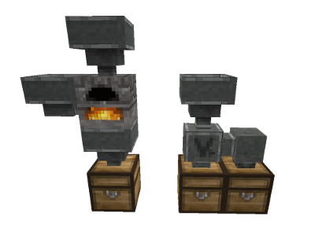

## Hoppers, chutes and sorters

Based on jordan4ibanez's original hoppers mod, optimized by TenPlus1 and FaceDeer, with chutes and sorters by FaceDeer

Hoppers are nodes that can transfer items to and from the inventories of adjacent nodes. The wide end of a hopper is its "input" end, if there's a chest or other compatible container it will take one item per second into its own internal inventory. It will also draw in items that have been dropped here. The narrow end of the hopper is its "output" end. It will attempt to inject items into a compatible container located at its output end. If there's no compatible container and the hopper's "eject" mode has been enabled it will instead dump the items out into the world.

The location of a hopper relative to a furnace determines which inventory slots the hopper will affect. A hopper directly above a furnace will inject items into the furnace's input slot. A hopper to the furnace's side will inject items into the furnace's fuel slot. A hopper below the furnace will pull items out of the furnace's output slot. Hoppers cannot inject items into inappropriate slots; non-fuel items will not be placed into the furnace's fuel slot and non-cookable items will not be placed into the input slot.

Also included in this mod are a "chute" node and a "sorter" node. These allow for items to be routed over short distances and distributed in sophisticated ways.

A chute simply moves items into adjacent nodes. You'll need to use a hopper or sorter to inject items into it to move along. A screwdriver is a useful tool for getting chutes aimed correctly.

A sorter has two different outputs. Its inventory has a "filter" grid; place items in this grid to set the sorter's filter. Items that match the filter will be sent out the output with the large arrow and other items will be sent out the output with the smaller arrow. A "filter all" option will cause the sorter to attempt to send *all* items in the direction of the large arrow and then if that fails send them in the direction of the smaller arrow. This allows you to have an "overflow" storage should the sorter's primary target fill up, or when used in combination with a selective container (like the furnace's fuel slot, for example) it allows the target inventory to do the filtering for you.

### Advanced settings

This mod has several configurable settings found in the advanced settings menu.

* Hopper texture size: can be set to 16 pixels (matching most standard Minetest node textures) or 32 pixels
* Single craftable item: When enabled (the default) hoppers are crafted as a single item and then select whether the output has a 90-degree turn to the side based on how you place it. When disabled you can craft straight and bent hoppers as separate items.
* Eject items button: this can be used to remove the "eject items" button from hoppers, if it is not desired.

### Change log

- 0.1 - Initial release from jordan4ibanez
- 0.2 - Fixed tool glitch (wear restored by accident)
- 0.3 - transfer function added
- 0.4 - Supports locked chest and protected chest
- 0.5 - Works with 0.4.13's new shift+click for newly placed Hoppers
- 0.6 - Remove formspec from hopper nodes to improve speed for servers
- 0.7 - Halved hopper capacity, can be dug by wooden pick
- 0.8 - Added Napiophelios' new textures and tweaked code
- 0.9 - Added support for Wine mod's wine barrels
- 1.0 - New furances do not work properly with hoppers so old reverted to abm furnaces
- 1.1 - Hoppers now work with new node timer Furnaces.  Reduced Abm's and tidied code.
- 1.2 - Added simple API so that hoppers can work with other containers.
- 1.3 - Hoppers now call on_metadata_inventory_put and on_metadata_inventory_take, triggering furnace timers via their standard callbacks. Updated side hopper rotation handling to allow it to function in any orientation. Added settings options to use 16-pixel or 32-pixel textures. Added settings option to allow explicit crafting of standard/side hoppers or to allow crafting of a single item that selects which type to use on place. Added in-game documentation via optional "doc" mod dependency
- 1.4 - Added intllib support
- 1.5 - Added chutes
- 1.6 - Added "eject items" button to formspecs, "group" support to the API
- 1.7 - Added sorter block to allow for more sophisticated item transfer arrangements

Lucky Blocks: 2
