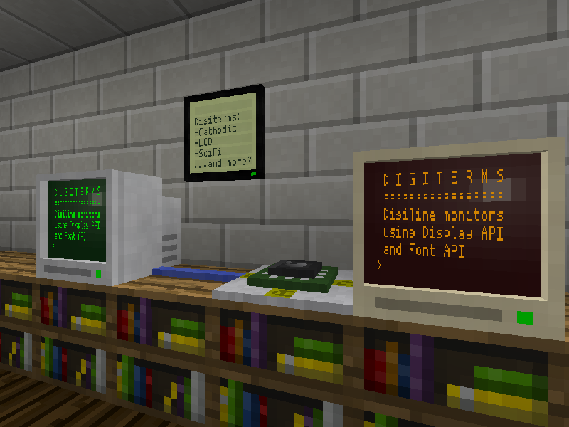

# Digiterms - Digilines Terminals
Version 0.2

Digilines monitors and keyboards mod for Minetest using Display API / Font API.

Monitors display text received on their digiline channel and works like digilines lcd monitor.

Keyboards send text ofer their digiline channel. In protected areas, keyboard can be set to "Public" to be usable by anybody. Else, only players granted rights on the area can use the keyboard.

Craft recipes depend on installed mods, please refer to craft guide in game.

If `scifi_nodes` mod is enabled, scifi monitors can be turned into digiterms by crafting scifi monitor with a digiline (some texture are derivated from D00Med mod).

**Version**: 0.1

**License**: LGPL v3 for the code, CC-BY-SA for the textures.

**Dependancies**: display_api, font_api, digilines, dye, default

**Optional dependancies**:xpane, scifi_nodes, basic_materials, homedecor, mesecons_microcontroller, mesecons_luacontroller, mesecons_materials

## Changelog

### 2018-12-13 (Version 0.2)
- Keyboards (Beige, white and black).
- Third cathodic monitor, the black one.
### 2018-12-09 (Version 0.1)
- Cathodic (2) and LCD monitors and corresponding craft recipes.
- Scifi nodes monitors : tallscreen, widescreen, glassscreen and keysmonitor
